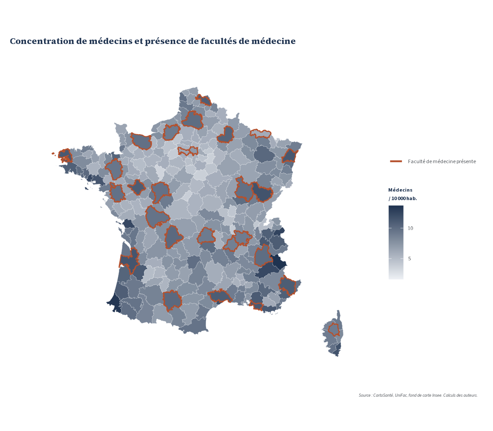
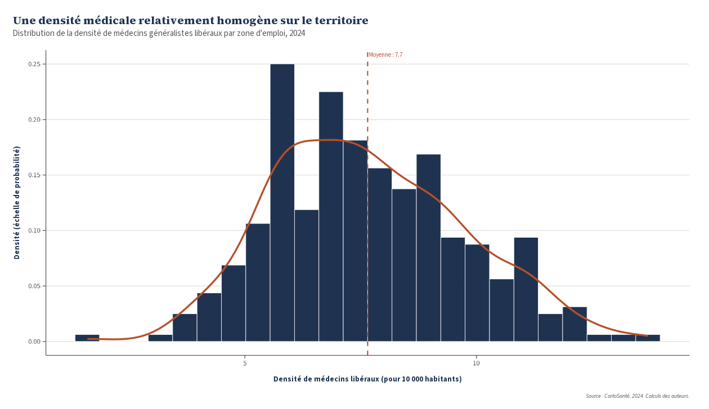
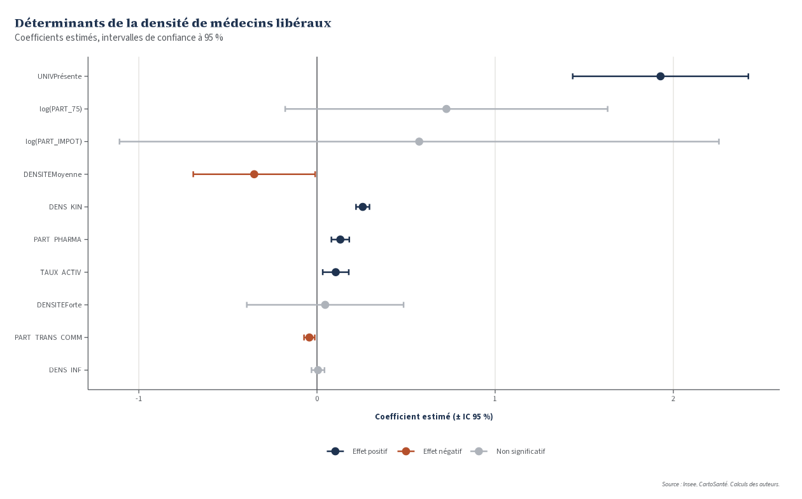

# Déterminants de la densité de médecins libéraux en France

Analyse économétrique de la densité de médecins généralistes libéraux sur les 306 zones d'emploi françaises. À partir de données Insee, CartoSanté et UniFac, le projet estime un modèle de régression linéaire multiple (MCO) qui mesure l'effet de facteurs démographiques, économiques et structurels sur l'offre de soins libérale d'un territoire, puis vérifie la validité des hypothèses des moindres carrés ordinaires. Le tout est écrit sous forme d'un rapport R Markdown reproductible, accompagné de scripts de figures et de cartographie.

Travail réalisé en Master 1 Mathématiques Appliquées et Statistique à l'Université de Rennes.

## Aperçu

Concentration de médecins et présence de facultés de médecine (2024) :



Distribution de la densité de médecins sur le territoire (2024) :



Coefficients du modèle retenu, après retrait des observations influentes :



Les autres figures produites par le rapport sont dans [docs/images/](docs/images/) : histogramme de la variable expliquée, panel de diagnostic des résidus, carte de densité de médecins.

## Stack technique

-   **R** et **R Markdown** (`rmdformats::robobook`) pour le rapport reproductible
-   **ggplot2** avec un thème maison, **patchwork** pour les panels
-   **dplyr** et **tidyr** pour la préparation des données
-   **sf** pour la lecture du fond de carte et la cartographie choroplèthe
-   **lmtest**, **car**, **broom** pour les diagnostics économétriques (VIF, Breusch-Pagan, distance de Cook)
-   **stargazer** pour les tables de régression, **ggcorrplot** pour la matrice de corrélation

## Ce que fait l'analyse

-   Nettoyage des données : suppression des zones trop incomplètes, imputation des valeurs manquantes restantes par la moyenne de la strate de densité de population.
-   Statistiques descriptives univariées et bivariées, matrice de corrélation de Pearson.
-   Diagnostics de colinéarité : règle de Klein, facteurs d'inflation de la variance, cohérence des signes.
-   Estimation d'un modèle de référence en niveau, puis d'une spécification avec transformations logarithmiques de deux variables asymétriques.
-   Batterie de tests de robustesse : moyenne nulle des résidus, Shapiro-Wilk, graphique quantile-quantile, homoscédasticité, distance de Cook, réestimation après retrait des points influents, comparaison MCO contre MCG.
-   Analyses complémentaires : termes quadratiques, interactions, test de Chow sur la présence d'une faculté de médecine.
-   Cartographie des résultats à l'échelle des zones d'emploi.

## Résultats principaux

Le dynamisme économique du territoire, mesuré par le taux d'activité et la part des ménages imposables, est associé positivement à la densité de médecins libéraux. La présence d'une faculté de médecine dans la zone d'emploi est le déterminant le plus net : la densité moyenne y est d'environ 9,6 médecins pour 10 000 habitants contre 7,4 ailleurs, avec une variance plus faible. L'effet de la part des 75 ans ou plus devient interprétable une fois la variable passée au logarithme, ce qui améliore la linéarité de la relation. Le test de Chow ne détecte pas de rupture structurelle selon la présence d'une université : les mêmes déterminants opèrent partout, avec une intensité qui varie. Après retrait des observations les plus influentes, le modèle retenu explique environ 74 % de la variance de la densité de médecins libéraux.

## Installation et exécution

Le projet a été testé avec R 4.5. Le fond de carte des zones d'emploi (Insee, millésime 2020) est inclus dans le dépôt sous `data/geo/`, il n'y a rien à télécharger séparément.

``` bash
git clone https://github.com/Abderrahmane35/densite-medecins-econometrie.git
cd densite-medecins-econometrie
```

Installation des packages, depuis R :

``` r
install.packages(c(
  "rmarkdown", "rmdformats", "knitr",
  "dplyr", "tidyr", "ggplot2", "patchwork", "scales",
  "gridExtra", "ggcorrplot", "ggdist",
  "lmtest", "car", "broom", "stargazer",
  "sf", "stringi"
))
```

Le fichier `DESCRIPTION` liste ces dépendances, `remotes::install_deps()` fait aussi l'affaire.

Génération du rapport, depuis la racine du dépôt :

``` r
rmarkdown::render("src/Projet.Rmd")
```

Le rendu produit `src/Projet.html`. Le rapport a besoin de Pandoc, fourni avec RStudio ou installable via `install.packages("pandoc")`.

## Structure du dépôt

```         
.
├── data/
│   ├── medecins.csv        # variables par zone d'emploi (deux lignes d'en-tête)
│   └── geo/                # fond de carte des zones d'emploi (shapefile Insee)
├── src/
│   ├── Projet.Rmd          # rapport complet, reproductible
│   └── R/
│       ├── 00_theme_palette.R       # palette et thème ggplot du projet
│       ├── 01_graphiques_descriptifs.R
│       ├── 02_graphiques_resultats.R
│       └── 03_cartes.R              # cartographie des zones d'emploi
├── docs/images/            # figures exportées, utilisées par ce README
└── DESCRIPTION             # liste des dépendances R
```

## Choix techniques et points d'attention

Le rapport et les figures sont séparés : `Projet.Rmd` porte l'analyse et le texte, les scripts de `src/R/` contiennent des fonctions de visualisation réutilisables, chacune prenant les données ou un modèle en argument.

Pour les valeurs manquantes, plutôt que de supprimer toutes les lignes concernées, l'imputation se fait par la moyenne de la strate de densité de population de la zone, ce qui conserve davantage d'observations tout en restant cohérent avec le profil du territoire.

La démarche ne s'arrête pas au R². Chaque hypothèse des MCO est testée explicitement, les points influents sont identifiés par la distance de Cook puis retirés, et le modèle est comparé à une estimation par moindres carrés généralisés pour vérifier la stabilité des coefficients.

La jointure entre les données tabulaires et le fond de carte se fait sur le libellé de zone d'emploi normalisé (accents retirés, casse uniformisée). Deux zones d'outre-mer portent le même nom, ce qui n'affecte pas les cartes puisqu'elles sont cadrées sur la France métropolitaine, mais une jointure sur un code officiel serait plus robuste si l'analyse était étendue aux DROM.

## Sources

-   Insee, Statistiques locales, zones d'emploi 2020
-   CartoSanté (AtlaSanté), indicateurs d'offre de soins 2024
-   UniFac, localisation des facultés de médecine

## Contact

[abderrahmane.mamoun\@univ-rennes.fr](mailto:abderrahmane.mamoun@univ-rennes.fr){.email}, [LinkedIn](https://www.linkedin.com/in/abderrahmane-mamoun-4183a6214/)
